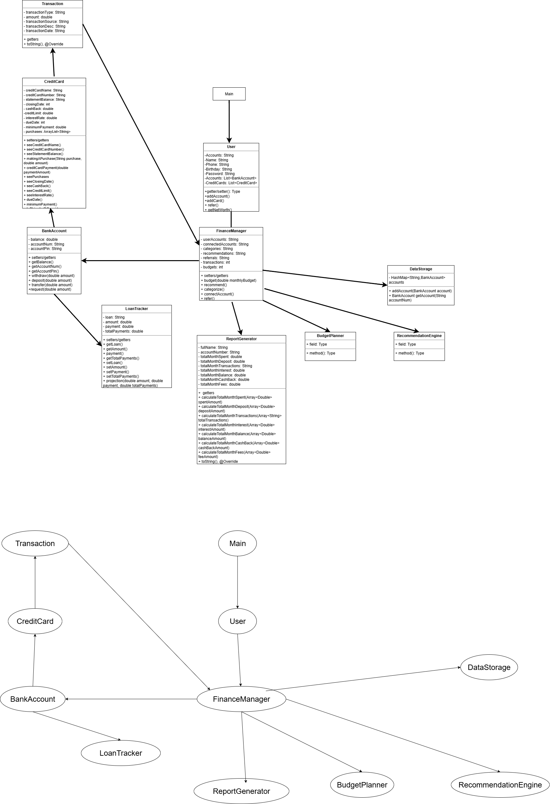

## CS 151 Project 1: Personal Finance Manager

### Overview

A **Java-based Personal Finance Manager** designed to help users manage their personal finances, track expenses, create budgets, and receive personalized recommendations based on their spending habits and financial goals.

This project applies core Object-Oriented Programming (OOP) principles such as **abstraction, inheritance, encapsulation, and polymorphism**. It was inspired by modern financial management tools like **Mint** and **Monarch Money**.

---

## Design

</img>  
<em>UML Diagram of the Personal Finance Manager system pictured above</em>

The design centers around the `User.java` and `FinanceManager.java` classes.  
When running the program through the terminal, the user is prompted to enter information that will be stored in a `User` object. This data is then passed into the `FinanceManager`, which acts as a **central controller** connecting multiple helper classes.

---

### System Flow

1. The program begins execution in `Main.java`
2. The user provides personal information, stored in `User.java`
3. The `FinanceManager` acts as the main controller, directing logic to different modules:
   - `BankAccount`
   - `CreditCard`
   - `LoanTracker`
   - `BudgetPlanner`
   - `ReportGenerator`
   - `RecommendationEngine`
   - `DataStorage`
   - `Transaction`

These components interact through **composition** and **aggregation** relationships.  
For example:

- `FinanceManager` aggregates `User`, `BankAccount`, and `CreditCard`
- `Transaction` is composed within `BankAccount` and `CreditCard`
- `BudgetPlanner` and `RecommendationEngine` analyze data and feed results back into the `FinanceManager`

---

## Class Overview

### Core Classes

**`User.java`**  
Stores user information such as name, age, income, and goals. Handles user creation and data input.

**`FinanceManager.java`**  
Acts as the central hub connecting all other classes, manages the overall system flow, and displays user summaries.

**`BankAccount.java`**  
Handles deposits, withdrawals, and tracking of balances for checking/savings accounts.

**`CreditCard.java`**  
Manages credit card information, billing cycles, and outstanding balances.

**`LoanTracker.java`**  
Calculates loan payments, interest accumulation, and payoff timelines.

---

### Supporting Classes

**`Transaction.java`**  
Represents individual financial transactions (amount, category, date, and type).

**`BudgetPlanner.java`**  
Analyzes income and expenses, categorizes spending, and creates budget suggestions.

**`ReportGenerator.java`**  
Generates summaries and detailed reports of user spending and progress over time.

**`RecommendationEngine.java`**  
Provides financial advice and recommendations based on spending trends, such as reducing high-category spending or optimizing savings.

**`DataStorage.java`**  
Handles saving and loading user data (e.g., to text or CSV files) for persistence between sessions.

---

## Implementation Details

**Language:** Java 8  
**Paradigm:** Object-Oriented Programming  
**Design Tool:** Draw.io (for UML Diagram)  
**IDE:** Visual Studio Code / IntelliJ IDEA  
**Version Control:** Git & GitHub

---

## Installation Instructions

### Pre-Requisites:

- **Java 8 or above**

  - [Download for Windows](https://www.oracle.com/java/technologies/downloads/)
  - [Download for macOS](https://www.oracle.com/java/technologies/downloads/#jdk24-mac)
  - Linux users can use their package manager.

- **Git (version 2.12 or above)**
  - [Git Download Page](https://git-scm.com/downloads)
  - (Optional) Set up SSH keys for GitHub: [Guide Here](https://docs.github.com/en/authentication/connecting-to-github-with-ssh)

---

# Usage

<strong>Step 1:</strong> Clone repository from https://github.com/heatherngyvn/PersonalFinanceManager-CS151-Fall-2025
 
<strong>Step 2:</strong> Change directory into the project directory in terminal/gitbash
 
<strong>Step 3:</strong> Run java Main or the Main.java file in the terminal
 
<strong>Step 4:</strong> Profit!

---

# Contributions

<strong>Will:</strong> I helped develop the system architecture and draft the UML diagram. Worked on FinanceManager, RecommendationEngine, test cases, and weaving the classes together in main.
 
<strong>Heather:</strong> Implemented User and CreditCard classes. Helped handle logic in main. Finished the UML diagram.
 
<strong>Kennedy:</strong> Wrote a lot of the code. Worked on main, LoanTracker, and debugging
 
<strong>Chyna:</strong> Made BankAccount and DataStorage classes
